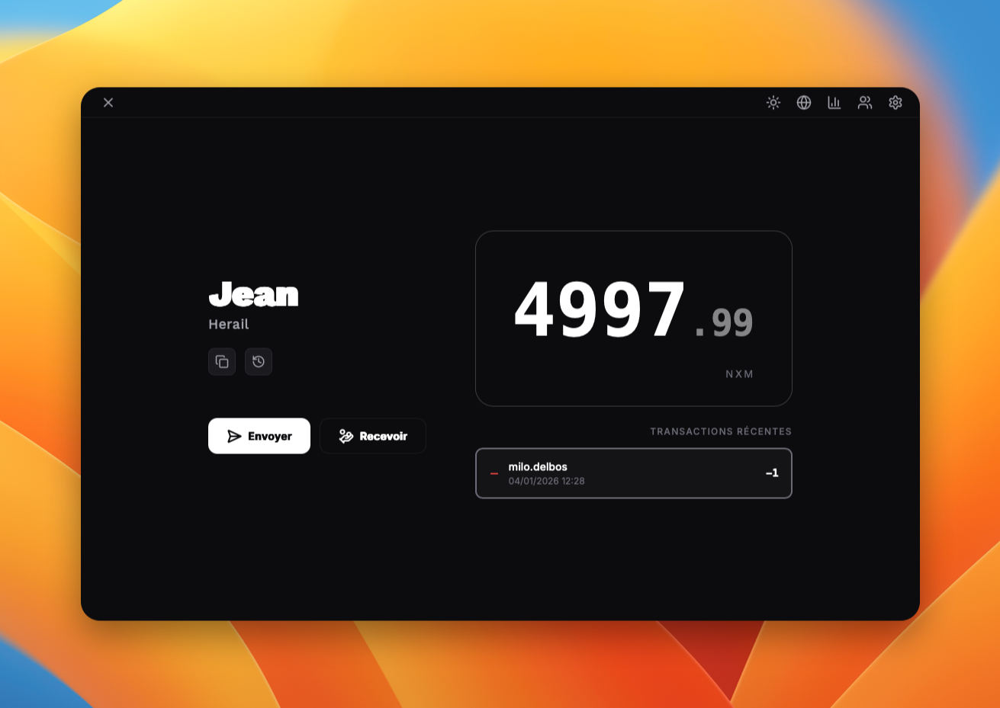
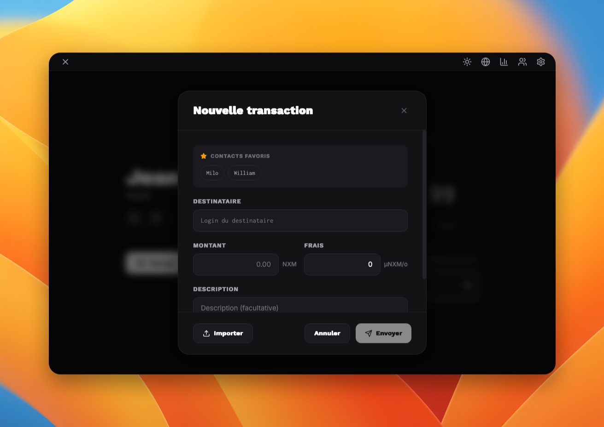

  

<h1 align="center">Nexium</h1>

  <em>A decentralized, blockchain-based cryptocurrency for Epita.</em>

---

## ✨ Features

### 🔗 Blockchain Architecture
- **Custom blockchain implementation** inspired by Bitcoin's architecture
- **Merkle Tree** structure for efficient transaction verification with O(log n) complexity
- **Proof of Work (PoW)** consensus mechanism with adjustable difficulty target
- **Binary storage** of blocks in `blockchain.dat` for optimized read/write operations
- **Bidirectional block traversal** via hash-based caching system

### 🔐 Cryptography
- **SHA-256 hashing** — Custom implementation for transaction signing, block generation, and chain linking
- **RSA encryption** — Asymmetric cryptography using 1024-bit keys for secure message exchange
- **Digital signatures** — Transaction authentication via RSA signatures

### 🌐 Decentralized Network
- **Peer-to-peer architecture** ensuring high availability and fault tolerance
- **Strong connectivity** based on graph theory for optimized node communication
- **Mempool synchronization** across all network nodes
- **EPITA login-based node restriction** — One node per member to prevent 51% attacks

### 💸 Transactions
- **Classic transactions** — Transfer NXM (Nexium currency) between users
- **Transaction fees** in µNEX/byte for miner incentives
- **Optional encrypted descriptions** using recipient's public key
- **Extensible transaction types** for future protocol versions

### 🖥️ Client Application
- **Cross-platform desktop app** built with [Tauri](https://tauri.app/) + [SvelteKit](https://kit.svelte.dev/)
- **Modern UI** with intuitive navigation
- **Contact management** and transaction history
- **Real-time server connection** status

### 🔑 EPITA Integration
- **GitLab API integration** for public key retrieval
- **Login-based identity** (`firstname.lastname`) for all users
- **Secure authentication** via EPITA credentials

---

## 📋 Overview

**Main language:** Rust  
**Target OS:** Linux

## 👥 Team and Contacts

| Name              | Email                                    |
| ----------------- | ---------------------------------------- |
| William Valenduc  | william.valenduc@epita.fr                |
| Jean Hérail       | jean.herail@epita.fr *(project manager)* |
| Antonin Bessières | antonin.bessieres@epita.fr               |
| Milo Delbos       | milo.delbos@epita.fr                     |

## 📸 Screenshots

  

<em>Main Page</em>

  

<em>Servers Page</em>

  

<em>Transaction Page</em>

---

## 🛠️ Development Setup

### VSCode Extensions

Please install the following extensions:

- [Rust](https://marketplace.visualstudio.com/items?itemName=1YiB.rust-bundle) — A bundle with useful extensions for Rust development
- [Live Share](https://marketplace.visualstudio.com/items?itemName=MS-vsliveshare.vsliveshare) — Share your code with other developers in real-time for live coding sessions

### ⚠️ Important

Before writing any code, **change your Word Wrap setting to `"wordWrapColumn": 80`** in your VSCode settings. This is essential, as our CdC requires the project to respect the 80 characters per line rule. If you have any questions about this procedure, ask on the group's Discord server.

### Developing with Tauri

To test the `nexium_client` package, use `cargo tauri dev` instead of `cargo run`. This will start the Tauri application and allow you to test the client.

## 📄 License

See the [LICENSE](LICENSE) file.
